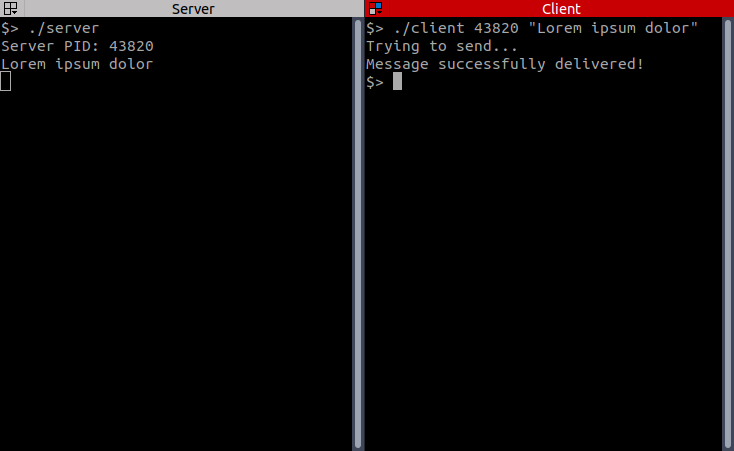

## Minitalk

### About

The purpose of this project is to code a small data exchange program using
UNIX signals.

* The server must be launched first, and after being launched it will display its PID.
* The client will take as parameters:
  * The server PID.
  * The string that should be sent.
* The client sends the string passed as a parameter to the server. Once
  the string was received, the server will display it.
* Communication between programs is done only using two UNIX signals: SIGUSR1 and SIGUSR2.
* Server can receive strings from several clients in a row, without
needing to be restarted.
* The client and server support all Unicode characters.

All functions are created in accordance with [Norm](https://github.com/42School/norminette) - the bunch of rules how code should be formatted.

### Requirements & usage
Project requires:
* C Lang compiler: **gcc** or **clang**
* Possibility to work with Makefile

Tested on:
* MacOS 10.15
* Linux Ubuntu 20.04

Run:
```
$> ./server
$> ./client [server_pid] [message]
```

